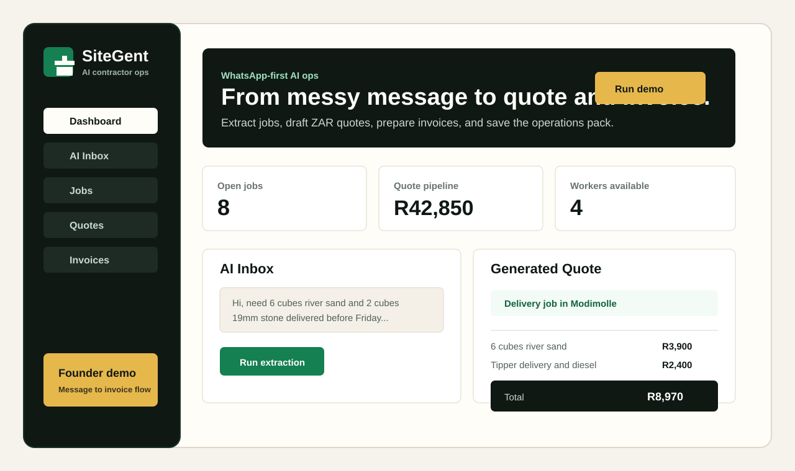
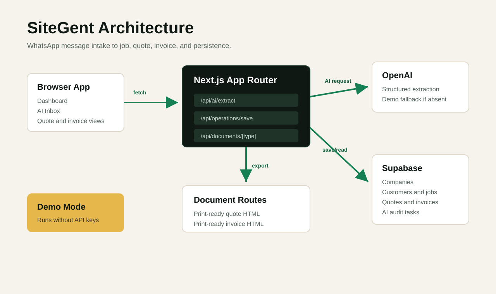

# SiteGent

SiteGent is a WhatsApp-first AI ops app for South African contractors. It turns messy customer messages into job cards, ZAR quote drafts, invoice drafts, and follow-up messages.



## Live Links

- Repo: <https://github.com/powelldevel/SiteAgent-AI>
- Live demo: <https://sitegent.vercel.app>
- Local: `http://localhost:3000`

## Try It

```bash
npm install
npm run dev
```

Open `http://localhost:3000`, click **Demo Mode**, then run extraction in **AI Inbox**.

No API keys are required for the demo flow. Without `OPENAI_API_KEY`, SiteGent uses a deterministic demo extractor. Without Supabase keys, saving stays in demo mode.

To verify the showable demo path while the dev server is running:

```bash
npm run demo:check
```

## What It Shows

- AI-style WhatsApp job intake
- Job card generation
- Quote draft with VAT and ZAR totals
- Invoice draft and print-ready document routes
- Optional Supabase persistence for saved jobs

## Architecture



More detail:

- [Architecture](docs/ARCHITECTURE.md)
- [API](docs/API.md)
- [Setup](docs/SETUP.md)
- [Screenshots](docs/SCREENSHOTS.md)
- [Supabase schema](supabase-schema.sql)

## Stack

- Next.js 16 App Router
- React 19
- Tailwind CSS 4
- Supabase
- OpenAI Responses API
- Zod

## Environment

Copy `.env.example` to `.env.local` only when you want live AI or Supabase persistence:

```bash
NEXT_PUBLIC_SUPABASE_URL=
NEXT_PUBLIC_SUPABASE_ANON_KEY=
SUPABASE_SERVICE_ROLE_KEY=
SITEGENT_DEMO_COMPANY_ID=
OPENAI_API_KEY=
OPENAI_MODEL=gpt-5.4-mini
```

OpenAI: create an API key in the OpenAI platform and paste it into `OPENAI_API_KEY`.

Supabase: run `supabase-schema.sql`, then paste the Project URL, legacy anon key, and legacy service role key from the Supabase dashboard. Keep `SUPABASE_SERVICE_ROLE_KEY` server-only.

The Settings screen shows whether OpenAI and Supabase are configured.

## Status

MVP/demo-ready. Before real customer data, add authenticated tenant checks to the API routes and tighten RLS coverage for all tables.
