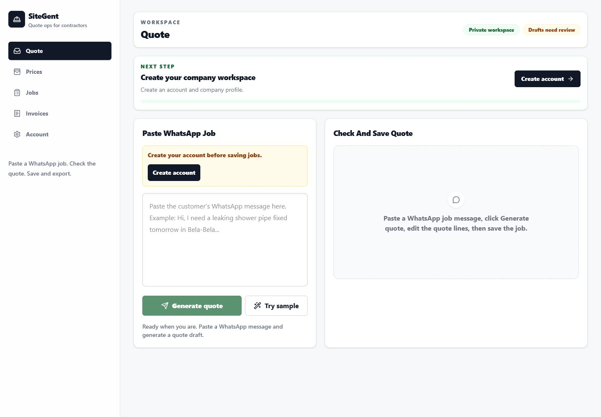
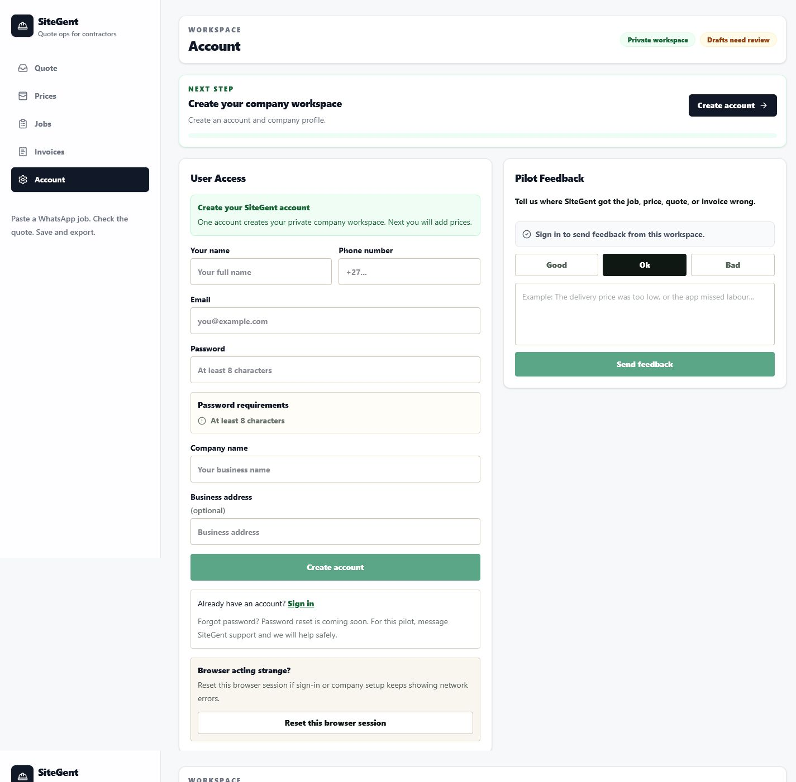
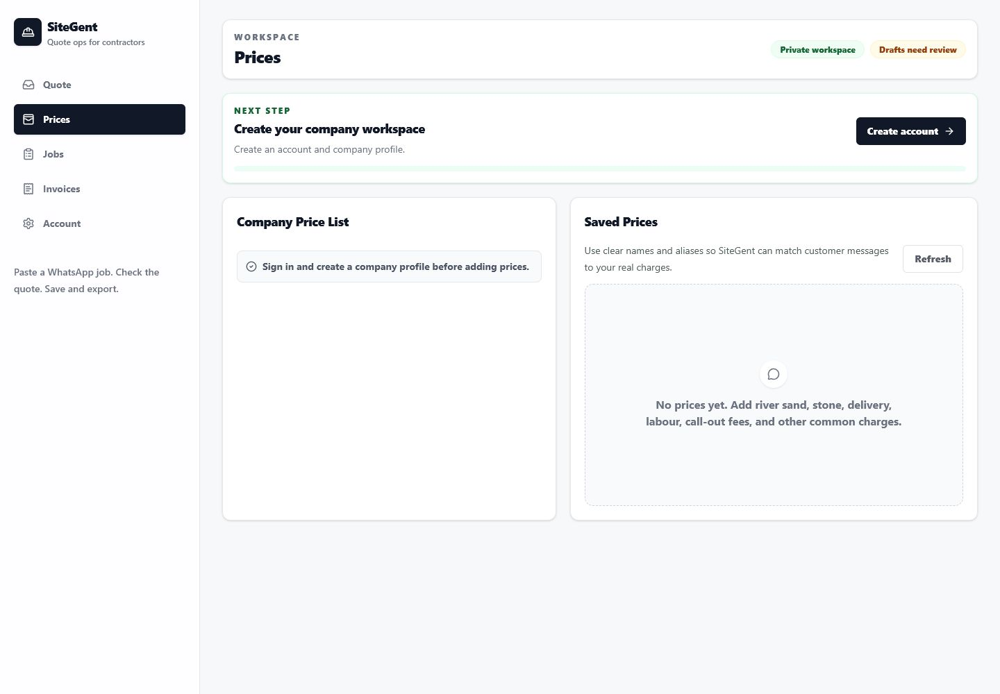
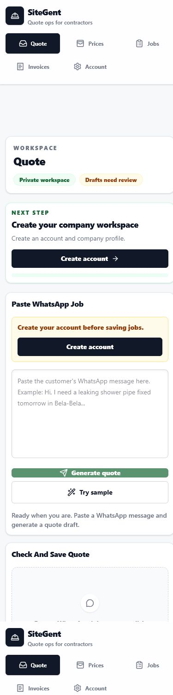
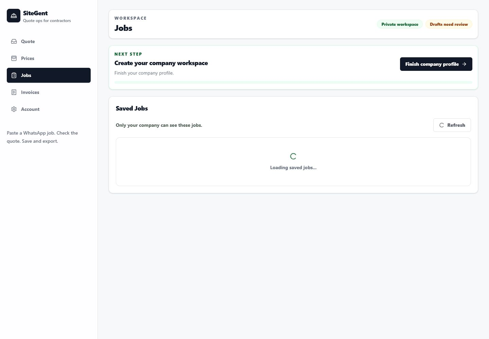
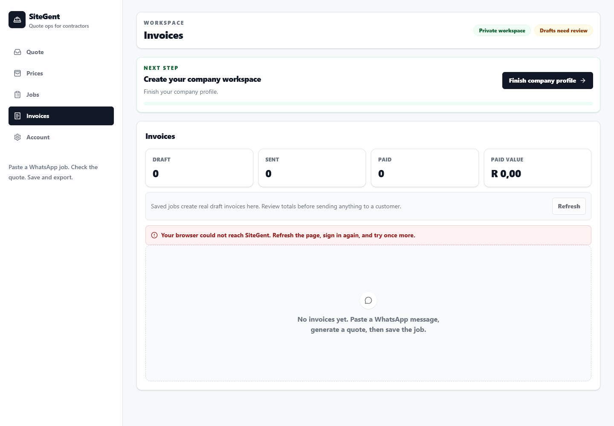
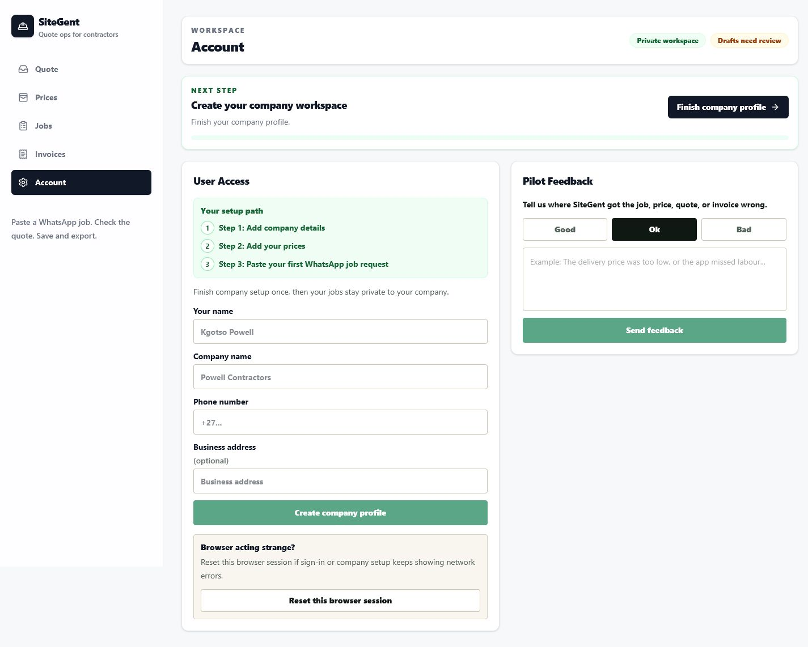

# SiteGent PRD and Product Overview

Version: Pilot overview  
Live app: https://sitegent.vercel.app  
Audience: contractors, testers, partners, potential investors, and collaborators

## Executive Summary

SiteGent is a WhatsApp-first AI operations app for South African contractors. It helps a contractor turn a messy customer WhatsApp job message into an editable job card, quote draft, invoice draft, follow-up message, and saved company-private job record.

The product is intentionally not a heavy CRM. The core workflow is:

```text
Create account -> add company details -> add prices -> paste WhatsApp message -> generate quote -> review/edit quote -> save job -> export quote/invoice
```

SiteGent is built for contractors and admin people who already run work through WhatsApp and need faster quoting without changing how they receive customer requests.

## Product Positioning

### One-line Description

SiteGent helps contractors turn WhatsApp job requests into editable job cards, quotes, invoices, and customer replies in minutes.

### Short Pitch

Contractors receive work in messy WhatsApp messages. SiteGent reads the message, extracts job details, uses the contractor's own price list, prepares a quote draft, creates a job card, and saves the work privately to that company. The contractor remains in control and reviews every price before sending anything to a customer.

### What SiteGent Is Not

SiteGent is not a full accounting system, payroll tool, enterprise CRM, or final pricing authority. It creates a practical draft that the contractor must review.

## Target Users

Primary users:

- Small and medium South African contractors
- Trades business owners
- Admin staff who handle quotes
- Estimators
- Owner-run service businesses

Early pilot categories:

- Sand, stone, and material delivery businesses
- Plumbers
- Electricians
- Builders
- Maintenance teams
- Handymen
- Local service and delivery operators

## Problem

Many contractors run day-to-day work from WhatsApp. A customer message often contains incomplete job details, rough quantities, location, urgency, and a phone number in one messy paragraph.

The contractor then has to:

- Understand the job
- Identify materials and labour
- Work out a quote
- Remember company prices
- Reply professionally
- Save the job
- Create an invoice later

This admin work is slow, repetitive, and easy to lose in WhatsApp chats.

## Product Goal

For the 15-user pilot, the goal is simple:

Help a contractor quote faster while keeping human review, company pricing, and private saved jobs.

Success does not mean full automation. Success means the contractor can produce a useful first quote draft faster than doing it manually.

## Core User Journey

1. User opens SiteGent.
2. User creates an account or signs in.
3. User creates a company profile.
4. User adds common company prices.
5. User pastes a WhatsApp job message.
6. SiteGent extracts customer, location, urgency, materials, and job summary.
7. SiteGent creates editable quote lines.
8. Quote lines show confidence:
   - Green: matched company price
   - Yellow: estimated price
   - Red: needs review
9. User edits quantities and prices.
10. User saves the job.
11. SiteGent saves customer, job, message, quote, quote items, invoice, and AI review record.
12. User exports a quote or invoice.
13. User sends the final reviewed document or message to the customer.

## Live App Screens

### First Screen: Quote Page

The first screen focuses on the main action: paste a WhatsApp message and generate a quote draft.



### Account and Signup

Users can create a SiteGent account with simple contractor-friendly labels: name, phone, email, password, company name, and business address.



### Prices Page

The Prices page is where a company adds its own charges. This is important because quotes should be based on the contractor's real rates, not generic AI guesses.



### Mobile View

The mobile layout is important because many contractors will open the app from phones while working from WhatsApp.



### Saved Jobs

The Jobs page shows saved work for the signed-in company. Jobs are private to the company workspace.



### Invoices

The Invoices page shows invoice drafts created from saved jobs. Users can export invoices and manage simple payment state.



### Company Profile Setup

If a signed-in user still needs company setup, SiteGent asks for the minimum information needed to create a private company workspace.



## Feature Overview

### 1. WhatsApp Message Intake

The user pastes a customer message or voice-note transcript. SiteGent is optimized for unstructured messages that mention customer needs, location, dates, quantities, materials, and phone numbers.

### 2. AI Job Extraction

The AI extraction endpoint turns the message into structured job data:

- Customer name
- Phone number
- Location
- Job type
- Urgency
- Estimated date
- Materials
- Missing details
- Job summary
- Quote line suggestions
- Follow-up message

Production security requires a signed-in user with a company before OpenAI is called.

### 3. Company Price List

Each company can add its own price items. A price item can include:

- Name
- Category
- Unit
- Unit price
- VAT rate
- Aliases
- Notes

Aliases help SiteGent match customer wording to company pricing. For example, "river sand", "sand", and "cubes river sand" can point to the same item.

### 4. Quote Confidence Labels

Quote lines communicate pricing trust clearly:

- Matched company price: exact match from the company price list
- Estimated price: AI or manual estimate
- Needs review: missing or unreliable price information

The goal is not to hide uncertainty. The goal is to help the contractor know what to check first.

### 5. Editable Quote Draft

Users can edit descriptions, quantities, unit prices, and line totals before saving. Totals and VAT are recomputed server-side before saving.

### 6. VAT Settings

Company VAT settings support South African contractor needs:

- VAT registered: yes/no
- VAT percentage defaults to 15%
- If not VAT registered, VAT is not charged
- If VAT registered, configured VAT is shown in quote and invoice totals

### 7. Transaction-safe Save

Saving an operations pack creates multiple records:

- Customer
- Job
- Original message
- Quote
- Quote items
- Invoice
- AI review task

The save flow uses a Supabase RPC/database transaction so all records save together or none save. This protects against partial saved jobs.

### 8. Saved Jobs

Saved jobs are company-scoped. A user from another company should not see another company's jobs.

### 9. Quote and Invoice Export

Saved quotes and invoices can be exported through server-side document routes. Exported documents are intended to be reviewed before being sent to customers.

### 10. Pilot Feedback and Analytics

The app includes lightweight pilot feedback and usage signals. These are for learning during the 5-to-15 user pilot and should not become a heavy admin dashboard in the contractor workflow.

## Technical Overview

### Stack

- Next.js App Router
- React
- TypeScript
- Supabase Auth
- Supabase Postgres
- Supabase Row Level Security
- OpenAI
- Vercel

### Main API Areas

- `/api/auth/signup`
- `/api/auth/signin`
- `/api/auth/me`
- `/api/auth/onboard`
- `/api/pricing`
- `/api/ai/extract`
- `/api/operations/save`
- `/api/saved-jobs`
- `/api/invoices`
- `/api/documents/quote`
- `/api/documents/invoice`
- `/api/feedback`
- `/api/analytics`
- `/api/health`
- `/api/readiness`

### Database Model

Core tables include:

- `companies`
- `users`
- `customers`
- `jobs`
- `quotes`
- `quote_items`
- `price_items`
- `invoices`
- `messages`
- `payments`
- `ai_tasks`
- `ai_extraction_usage`
- `observability_events`

### Privacy and Security

Production readiness includes:

- Supabase authentication
- Company-scoped data
- Row Level Security enabled on core tables
- Saved jobs private per company
- Server-side OpenAI key
- AI extraction blocked for anonymous users
- Per-user and per-company AI extraction quota support
- Server-generated quote and invoice numbers
- Transaction-safe save flow

## Current Readiness

Production checks have passed for:

- Signup flow
- Signin flow
- Company onboarding
- Price-list import
- Quote generation
- Job save
- Quote export
- Invoice export
- VAT handling
- Tenant isolation
- Server-generated quote numbers
- Server-generated invoice numbers
- Anonymous AI extraction blocked
- Feedback events
- Pilot funnel signals

## Known Manual Review Notes

During screenshot capture, a browser-based temporary profile setup action appeared to hang in the automation session. Existing automated production checks still passed for onboarding. This should be manually checked with a fresh human browser session before sending the app to all 15 testers.

Other items to review manually:

- Email confirmation behavior in Supabase
- Whether first-time contractors understand the Prices page
- Whether quote exports look professional enough for real customers
- Whether invoice exports match local business expectations
- Whether long WhatsApp messages remain readable on mobile

## What Is Not Built Yet

Not yet in scope for the pilot:

- Full CRM
- Accounting integration
- Payroll
- Stock management
- Online card payments
- Team roles and permissions beyond the current owner-style flow
- WhatsApp Business API automation
- Customer portal
- Advanced scheduling
- Full admin console

These should not be built until the first 5-to-15 testers prove the quote workflow is valuable.

## Pilot Plan

### First 5 Testers

Goal: confirm that users can complete the core flow without hand-holding.

Measure:

- Can they sign up?
- Can they add prices?
- Can they paste a real message?
- Does the quote draft help?
- Do they understand confidence labels?
- Can they save a job?
- Can they export a quote or invoice?
- What do they not trust?

### Next 10 Testers

Goal: confirm repeat usefulness across more contractor types.

Measure:

- Time saved per quote
- Number of quotes generated
- Number of saved jobs
- Export usage
- Price-list completeness
- User confusion points
- Willingness to pay

## Business Value

SiteGent can create value by reducing the admin gap between customer message and professional quote.

For contractors:

- Faster quote preparation
- Less manual copying from WhatsApp
- Better saved job history
- More consistent quote and invoice format
- Company prices reused across jobs

For the business:

- Narrow, clear first product wedge
- Strong WhatsApp-first positioning
- Low-friction pilot
- Practical AI use case with human review
- Potential to expand into payments, WhatsApp sending, and lightweight operations only after quoting proves value

## Risks and Assumptions

### Product Risks

- Users may not add price lists fully enough.
- Users may expect the AI to be final instead of draft.
- Contractors may need trade-specific templates.
- Export formatting may need polishing for customer-facing use.

### Technical Risks

- OpenAI costs must be controlled through authentication and rate limits.
- Supabase email confirmation settings can affect signup.
- Saved-job privacy must remain protected through RLS and API checks.
- Document export routes must stay reliable on Vercel.

### Commercial Risks

- Users may like the demo but not pay.
- Some contractors may prefer WhatsApp-only automation rather than opening a web app.
- Different trades may require different pricing assumptions.

## Roadmap

### Next Week

- Manually test onboarding in a fresh Chrome profile.
- Invite 5 testers.
- Watch users add their first prices.
- Review 10 real pasted WhatsApp messages.
- Improve confusing copy only where users get stuck.
- Keep feedback collection simple.

### Next Month

- Improve quote and invoice document polish.
- Add better example price-list guidance by trade.
- Add clearer empty states for users with no prices.
- Review OpenAI usage and cost.
- Improve support process for testers.

### Next 3 Months

- Decide whether to add WhatsApp send/copy workflows.
- Add simple payment collection only if quote/invoice export is being used.
- Add team access only if companies ask for it.
- Build trade-specific quote templates only after clear demand.
- Prepare a paid pilot offer.

## Acceptance Criteria for the Pilot Product

SiteGent is pilot-ready when:

- A new user can create an account.
- A user can create a company profile.
- A user can add or paste prices.
- A user can paste a WhatsApp job request.
- AI extraction returns useful job details.
- Quote lines are editable.
- Quote confidence is clear.
- User can save a job.
- User can export quote and invoice.
- A second company cannot see the first company's jobs.
- Users understand that all prices are drafts requiring review.

## Final Product Principle

SiteGent should stay simple:

```text
Paste WhatsApp message -> check quote -> save job -> export quote/invoice
```

Everything else should earn its place by helping a contractor quote faster.
